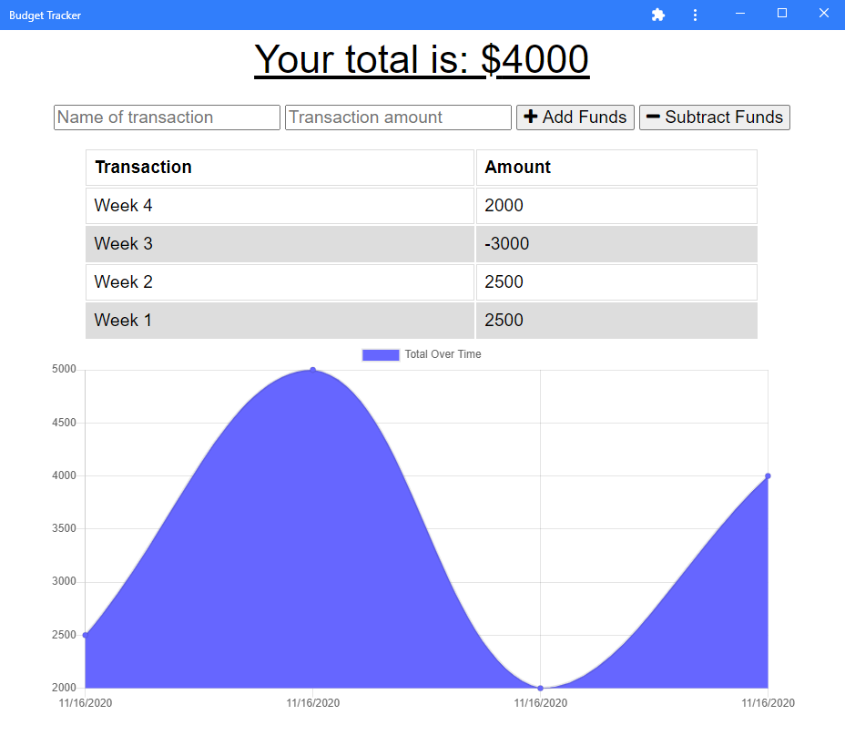

  # Budget-Tracker-PWA

  

  ## Descripton
  Created a PWA from provided front-end and back-end files for a budget tracking app. This application is currently deployed on Heroku and is connected to a Mongo Database hosted via Atlas: MongoDB. In addition, the applicaiton has been given offline functionality through the use of the IndexedDB and a service worker. 

  ## Table of Contents
  * [Installation](#installation)
  * [Usage](#usage)
  * [Contributing](#contributing)
  * [Tests](#tests)
  * [Questions](#questions)

  ## Installation 
    
  *Steps required to install package:* 
    
  In the root directory, type `npm i` to install all necessary packages. You will also need to create a MongoDB to connect the applicaiton to. 

  ## Usage

  *Examples of project use:*

  [https://thawing-crag-91029.herokuapp.com/](https://thawing-crag-91029.herokuapp.com/)
  
  

  ## Contributing

  *If you are interested in contributing to this project, please follow the below instructions:*

  Pull requests not welcome at this time. 

  ## Tests

  *Application tests and instructions for them:*

  N/A

  ## License

  None
  

  ## Questions

  *If you have any questions regarding this application, please utilize the below contact information:*

  [kmiller343@gmail.com](mailto:kmiller343@gmail.com)
  
  [GitHub Profile](https://www.github.com/k1te-m)
  
